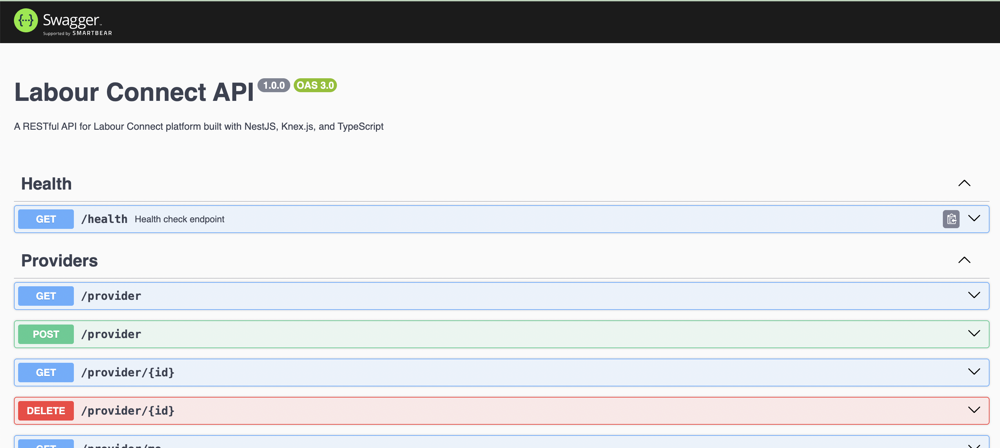
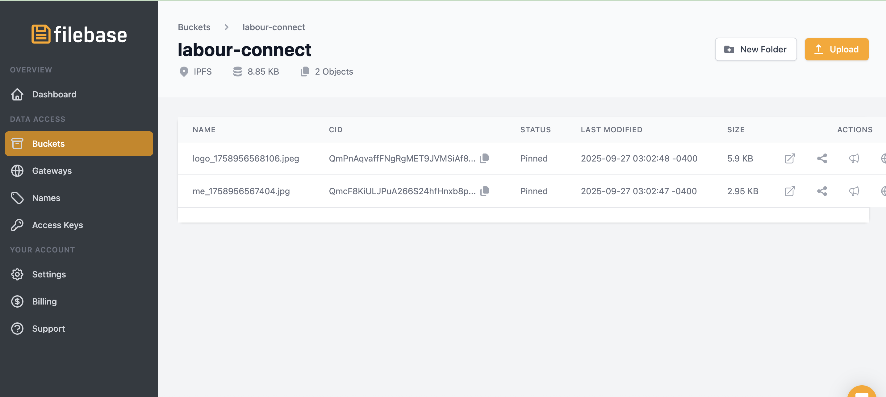
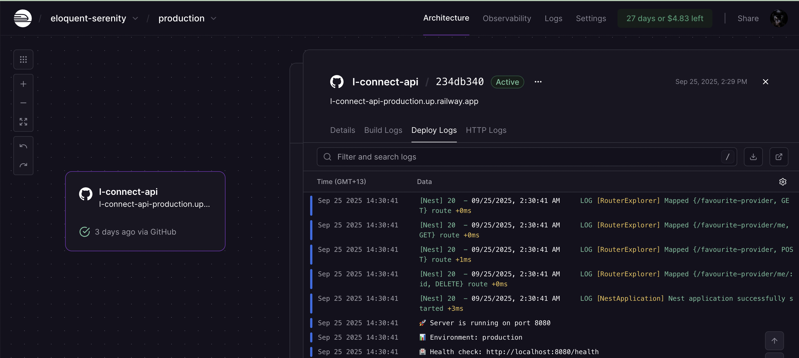
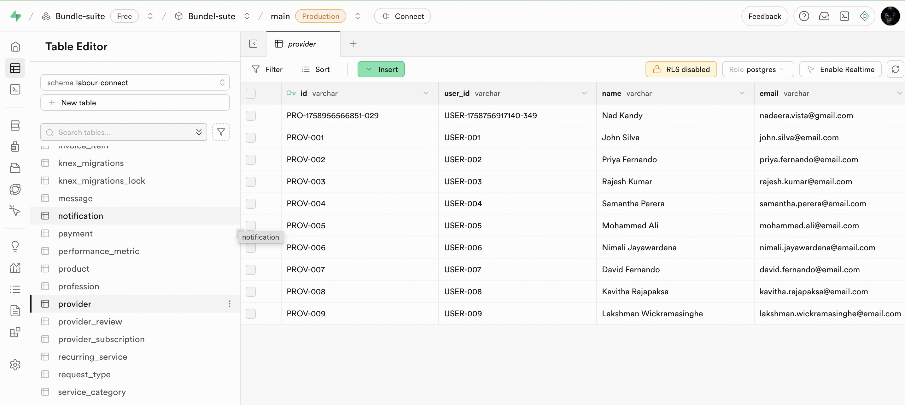
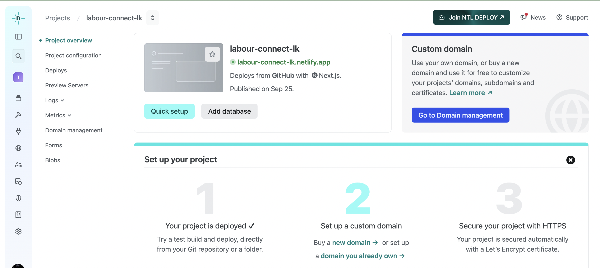
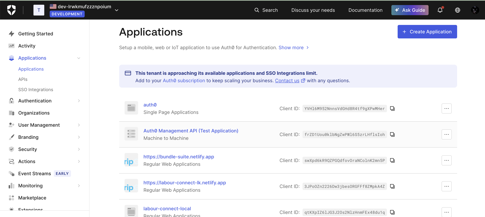
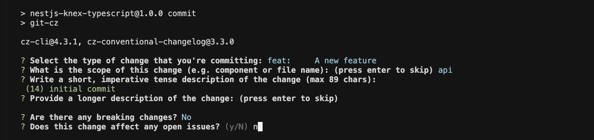

# 🚀 Labour Connect API

A modern NestJS-based backend API for connecting skilled laborers with customers, built with TypeScript, PostgreSQL, and serverless architecture.

## 🌐 Live Demo

[](https://labour-connect-lk.netlify.app/)
[](http://localhost:3000/api-docs)

- **🚀 Production**: [https://labour-connect-lk.netlify.app/](https://labour-connect-lk.netlify.app/)
- **📚 API Documentation**: [http://localhost:3000/api-docs](http://localhost:3000/api-docs) (when running locally)
- **🔧 Development**: Clone and run `npm run start:dev`

## 📋 Table of Contents

- [Features](#-features)
- [Tech Stack](#-tech-stack)
- [Quick Start](#-quick-start)
- [API Documentation](#-api-documentation)
- [Development](#-development)
- [Deployment](#-deployment)
- [Contributing](#-contributing)

## ✨ Features

- 🔐 **Authentication** - Auth0 integration for secure user management
- 🏗️ **Service Management** - Complete CRUD operations for customers and providers
- 📊 **Analytics** - Built-in metrics and reporting
- 🚀 **Serverless Ready** - Optimized for cloud deployment
- 📱 **API Documentation** - Interactive Swagger/OpenAPI documentation
- 🧪 **Testing** - Comprehensive test suite with Jest
- 🔄 **CI/CD** - Automated testing and deployment

## 🛠️ Tech Stack

### Backend

- **Framework**: NestJS with TypeScript
- **Database**: PostgreSQL with Knex.js query builder
- **Authentication**: Auth0
- **Testing**: Jest with Supertest
- **Documentation**: Swagger/OpenAPI

### Infrastructure

- **Storage**: Filebase (S3-compatible)
- **Deployment**: Railway/Render
- **Frontend**: Netlify
- **Project Management**: Shortcut

## 🚀 Quick Start

### Prerequisites

- Node.js (use `nvm` with `.nvmrc`)
- PostgreSQL
- Docker (optional for local database)

### Installation

```bash
# Clone the repository
git clone <repository-url>
cd sample-labour-connect-api

# Install dependencies
npm install

# Set up environment variables
cp env.example .env
# Edit .env with your configuration

# Run database migrations
npm run migrate

# Start development server
npm run start:dev
```

### Environment Setup

Create a `.env` file with the following variables:

```env
NODE_ENV=development
DATABASE_HOST=localhost
DATABASE_PORT=5432
DATABASE_USER=your_username
DATABASE_PASSWORD=your_password
DATABASE_NAME=labour_connect
AUTH0_DOMAIN=your_auth0_domain
AUTH0_CLIENT_ID=your_client_id
AUTH0_CLIENT_SECRET=your_client_secret
```

## 📚 API Documentation

### Interactive Documentation

Access the Swagger UI at `http://localhost:3000/api-docs` when running locally.



### Available Endpoints

- **Health Check**: `GET /health`
- **Authentication**: `POST /auth/login`
- **Users**: `GET /users`, `GET /users/:id`, `DELETE /users/:id`
- **Customers**: `GET /customer`, `POST /customer`, `PATCH /customer/me`
- **Providers**: `GET /provider`, `POST /provider`, `PATCH /provider/me`
- **Cities**: `GET /cities`

## 🏗️ Development

### Code Quality

This project enforces high code quality standards:

- **ESLint** - Code linting and formatting
- **Prettier** - Code formatting
- **Husky** - Git hooks for pre-commit checks
- **TypeScript** - Static type checking

### Pre-commit Hooks

The project uses Husky to ensure code quality:

```bash
# Pre-commit checks include:
- TypeScript compilation
- ESLint linting
- Prettier formatting
- Test execution
- Commit message validation
```

### Testing

```bash
# Run all tests
npm run test

# Run tests in watch mode
npm run test:watch

# Run tests with coverage
npm run test:coverage
```

## 🚀 Deployment

### Serverless Architecture

The application is designed for serverless deployment:

#### Storage



- **Filebase** - S3-compatible object storage
- **Railway** - Database hosting
- **Render** - Application hosting

#### Database



- **Railway** - PostgreSQL database hosting
- **Supabase** - Alternative database solution



#### Frontend



- **Netlify** - Frontend hosting and CI/CD

### Authentication



- **Auth0** - Authentication and user management

### Project Management


- **Shortcut** - Project management and issue tracking

## 📝 Contributing

### Commit Convention

This project uses **Semantic Commits** following the [Conventional Commits](https://www.conventionalcommits.org/en/v1.0.0/) specification.



#### Available Commit Types:

- `feat:` - New features
- `fix:` - Bug fixes
- `docs:` - Documentation changes
- `style:` - Code style changes
- `refactor:` - Code refactoring
- `test:` - Test additions/changes
- `chore:` - Build process or auxiliary tool changes

#### Examples:

```bash
feat: add user authentication endpoint
fix: resolve database connection timeout
docs: update API documentation
feat(api)!: breaking change in user service
```

#### Interactive Commit Tool:

```bash
npm run commit
```

This will guide you through creating a properly formatted commit message.

### Development Workflow

1. **Create Feature Branch**

   ```bash
   git checkout -b feat/new-feature
   ```

2. **Make Changes**
   - Write code following TypeScript best practices
   - Add tests for new functionality
   - Update documentation if needed

3. **Commit Changes**

   ```bash
   npm run commit
   ```

4. **Push and Create PR**
   ```bash
   git push origin feat/new-feature
   ```

## 🔧 Available Scripts

```bash
# Development
npm run start:dev          # Start development server
npm run start:debug        # Start with debugging
npm run build              # Build for production

# Database
npm run migrate            # Run database migrations
npm run seed               # Seed database with sample data
npm run migrate:rollback   # Rollback last migration

# Code Quality
npm run lint               # Run ESLint
npm run lint:fix           # Fix ESLint issues
npm run format             # Format code with Prettier
npm run type-check         # Run TypeScript type checking

# Testing
npm run test               # Run tests
npm run test:watch         # Run tests in watch mode
npm run test:coverage      # Run tests with coverage
npm run test:ci            # Run tests for CI

# Git Hooks
npm run commit             # Interactive commit tool
npm run prepare            # Install Husky hooks
```

## 📊 Project Structure

```
src/
├── modules/           # Feature modules
│   ├── user/         # User management
│   ├── customer/     # Customer operations
│   ├── provider/     # Provider operations
│   └── city/         # City management
├── utils/            # Utility functions
├── config/           # Configuration files
├── test/             # Test files
└── main.ts           # Application entry point
```

## 📞 Support

For support and questions:

- **Project Management**: https://app.shortcut.com/labour-connect/iterations
- **Issues**: Create an issue in the repository

---

**Built with ❤️ for the Labour Connect project**
